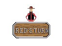

<a name="readme-top"></a>

[![LinkedIn][linkedin-shield]][linkedin-url]

<!-- PROJECT TITLE -->
<div align="center">
<h3 align="center">Ricochet</h3>
  <p align="center">
    Multiplayer iOS Game
    <br />
  </p>
</div>

<!-- ABOUT THE PROJECT -->
## About The Project

<p align="center">
  
</p>

This is a 2-player iOS party game that was published to the AppStore in 2021. In this turn-based game, every player fires a bullet that will ricochet through the saloon. The goal is simple, be the last one standing in the saloon!

This is a memory game, bullets will bounce exactly once before sticking to the second surface. They are then freezed in time. Every time a player shoots a new bullet, his past bullets (frozen in time) will continue their trajectory for one more bounce before freezing again.

To enforce this dynamic, if Player A hits Player B with a bullet that was never frozen in time, he loses the game.


### Built With


<!-- GETTING STARTED -->
## Getting Started

The game is not longer available on the AppStore because of how pricy a Apple Developer License is every year. The only way to play it now is to download the source code and to build it using Unity.

### Prerequisites


* Unity 2020.3.10f1


### Installation


1. Clone the repo
   ```sh
   git clone https://github.com/e-p-l/ricochet.git
   ```
2. Open the project using Unity Hub

3. Build the project and enjoy :)


<!-- MARKDOWN LINKS & IMAGES -->
[linkedin-shield]: https://img.shields.io/badge/-LinkedIn-black.svg?style=for-the-badge&logo=linkedin&colorB=555
[linkedin-url]: https://www.linkedin.com/in/edouard-perrault-laliberte/
